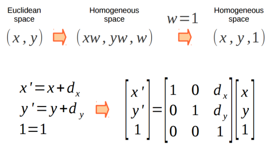

# CG_trabalho2
---

## Introdução

Este trabalho busca mostrar e execução do pipeline gráfico do OpenGL com um objeto exemplo. O pipeline gráfico é composto por fases chamadas de espaços, e em cada uma delas o objeto pode sofrer transformações, quase todas representadas por matrizes, até se chegar ao resultado final que será exibido na tela do usuário. 

## O Pipeline Gráfico

O pipeline gráfico começa no Espaço de Objeto, onde o objeto a ser transformado é criado a partir de vértices num espaço cartesiano. Aqui, o objeto pode sofrer transformações de escala, traslação e rotação, cada uma atráves de sua matriz característica, que serão implementadas na matriz Model. Estas transformações levam ao Espaço do Universo, onde a matriz View é responsável pelas transformações que levam ao espaço da câmera. Aqui, o objeto recebe as transformações da Matriz de Projeção para chegar ao Espaço de Recorte, onde as coordenadas atuais do objeto são divididas pela coordenada homogênea w. Chegamos então, ao Espaço Canônico, onde a matriz Viewport é responsável por rasterizar os vértices do objeto, que serão então exibidos no Espaço de Tela de forma que o usuário possa vê-los.

Nosso pipeline contém as seguintes tranformações:

	 
	
	<h5 align="center">Figure 1 - O Pipeline Gráfico</h5>
	 

### 1 - Do Espaço do Objeto para o Espaço do Universo
Tendo as coordenadas dos vértices do objeto, é preciso posicionar o objeto no universo. Para isso, usamos a matriz Model. Essa matriz é composta por um produto de matrizes de escala, translação e rotação.

Matriz de Escala:
Altera o tamanho do objeto no espaço do universo.

	 
	
	<h5 align="center">Figure 2 - Matriz de escala</h5>
	 

Matriz de Translação:
Move um objeto no espaço do universo.

	 
	
	<h5 align="center">Figure 2 - Matriz de Translação</h5>
	 

# Referências Bibliográficas

Notas de Aula do Prof. Christian

---

Toolkit: OpenGL | Glut | Computer Graphic | C++

---

# Colaboradores

Ruan Vitor da Silva francisco - 20170002515

Naiara Rodrigues de Brito - 20170008377
