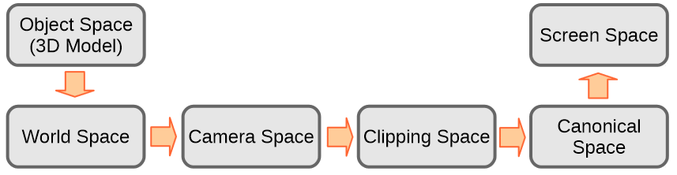
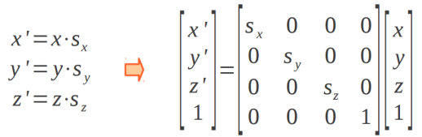
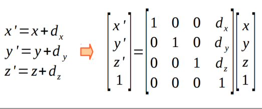

# CG_trabalho2
---

## Introdução

Este trabalho busca mostrar e execução do pipeline gráfico do OpenGL com um objeto exemplo. O pipeline gráfico é composto por fases chamadas de espaços, e em cada uma delas o objeto pode sofrer transformações, quase todas representadas por matrizes, até se chegar ao resultado final que será exibido na tela do usuário. 

## O Pipeline Gráfico

O pipeline gráfico começa no Espaço de Objeto, onde o objeto a ser transformado é criado a partir de vértices num espaço cartesiano. Aqui, o objeto pode sofrer transformações de escala, traslação e rotação, cada uma atráves de sua matriz característica, que serão implementadas na matriz Model. Estas transformações levam ao Espaço do Universo, onde a matriz View é responsável pelas transformações que levam ao espaço da câmera. Aqui, o objeto recebe as transformações da Matriz de Projeção para chegar ao Espaço de Recorte, onde as coordenadas atuais do objeto são divididas pela coordenada homogênea w. Chegamos então, ao Espaço Canônico, onde a matriz Viewport é responsável por rasterizar os vértices do objeto, que serão então exibidos no Espaço de Tela de forma que o usuário possa vê-los.

Nosso pipeline contém as seguintes tranformações:

<p align="center">
	<br>
	
	<h5 align="center">Figure 1 - O Pipeline Gráfico</h5>
	<br>
</p>

### 1 - Do Espaço do Objeto para o Espaço do Universo
Tendo as coordenadas dos vértices do objeto, é preciso posicionar o objeto no universo. Para isso, usamos a matriz Model. Essa matriz é composta por um produto de matrizes de escala, translação e rotação.

Matriz de Escala:
Altera o tamanho do objeto no espaço do universo.

<p align="center">
	<br>
	
	<h5 align="center">Figure 2 - Matriz de escala</h5>
	<br>
</p>

Matriz de Translação:
Move um objeto no espaço do universo.

<p align="center">
	<br>
	
	<h5 align="center">Figure 2 - Matriz de Translação</h5>
	<br>
</p>

No código, definimos as matrizes usando a biblioteca GLM, que recebe colunas no formato de linha:

```
//Matriz Model

    mat4x4 mTranslation = mat4x4(1, 0, 0, 0,
                                 0, 1, 0, 0,
                                 0, 0, 1, 0,
                                tx, ty, tz, 1); //tx, ty e tz são os valores de translação

    mat4x4 mScale = mat4x4(sx, 0, 0,  0,
                           0, sy, 0,  0,
                           0,  0, sz, 0,
                           0,  0, 0,  1); //sx, sy e sz são os valores de escala

    mat4x4 mRotate = mat4x4(cos(angulo), 0, -sin(angulo), 0,
                                 0,      1,       0,      0,
                            sin(angulo), 0, cos(angulo),  0,
                                 0       0,       0,      1); //rotação no eixo Y, em relação ao ângulo

    mat4x4 mModel = mScale * mTranslation * mRotate; //Construção da matriz Model

```

### 2 - Do Espaço do Universo para o Espaço da Câmera
Depois de os objetos estarem devidamente posicionados no Espaço do Universo, é preciso definir uma câmera que funcionará como ponto de vista do espaço montado. Para construção da câmera, são necessárias sua posição, o vetor up (que define sua orientação) e o vetor look at, que indica o ponto para qual a câmera está direcionada. 

Na implementação, são recebidos os parâmetros e é gerado o vetor distância com base no look at e na posição para o cálculo do sistema de coordenadas da câmera.  
```
  //Matriz View

    vec3 lookatCam = vec3(0, 0, 0);
    vec3 posCam = vec3(3, 2, 2);
    vec3 upCam = vec3(0, 1, 0);

    vec3 dirCam = lookatCam - posCam;

    vec3 zCam = -normalize(dirCam);
    vec3 xCam = normalize(cross(upCam, zCam));
    vec3 yCam = cross(zCam, xCam);

    mat4x4 Bt = mat4x4(xCam[0], yCam[0], zCam[0], 0,
                       xCam[1], yCam[1], zCam[1], 0,
                       xCam[2], yCam[2], zCam[2], 0,
                       0, 0, 0, 1);

    mat4x4 T = mat4x4(1, 0, 0, 0,
                      0, 1, 0, 0,
                      0, 0, 1, 0,
                      -dirCam[0], -dirCam[1], -dirCam[2], 1);

    mat4x4 mView = Bt * T;
```

### 3 - Do Espaço da Câmera para o Espaço de Recorte
O espaço de recorte é responsável por transformar os vértices do objeto permitindo a aplicação da distorção perspectiva. A semelhança de triângulos foi usada para o cálculo da matriz de projeção que é combinada à uma matriz de translação que corrige a distância da câmera ao plano de visão.
No pipeline, o valor d representa a distância focal da câmera que observa a cena.
```
//Matriz projeção

    int d = 1;

    mat4x4 mProjection = mat4x4(1, 0, 0,     0   ,
                                0, 1, 0,     0   ,
                                0, 0, 1, -(1 / d),
                                0, 0, d,     0  );

```

### 4 - Do Espaço de Recorte para o Espaço Canônico
Quando a transformação para o espaço de recorte é aplicada, o valor da coordenada homogênea (w) dos vértices se torna um valor provavelmente diferente de 1, é preciso transformar os vértices de volta para o espaço euclidiano para que possam ser exibidos em uma tela bidimensional com a distorção perspectiva.

### 5 - Do Espaço Canônico para o Espaço de Tela
A última etapa do pipeline transforma os vértices para o espaço de tela, Essa transformação consiste em uma matriz que inverte o eixo Y, uma que adapta o tamanho do objeto ao lado positivo do plano euclidiano e uma matriz que transforma os vértices para que possam ser rasterizados nas coordenadas de tela.

```
//Matriz viewport

    int w = 512;
    int h = 512;

    mat4x4 mViewTranslate = mat4x4(1, 0, 0, 0,
                                   0, 1, 0, 0,
                                   0, 0, 1, 0,
                                   (w - 1) / 2, (h - 1) / 2, 0, 1);

    mat4x4 mViewScale = mat4x4(w / 2, 0, 0, 0,
                               0, h / 2, 0, 0,
                               0, 0, 1, 0,
                               0, 0, 0, 1);

    mat4x4 mViewInvert = mat4x4(1, 0, 0, 0,
                                0, -1, 0, 0,
                                0, 0, 1, 0,
                                0, 0, 0, 1);

    mat4x4 mViewport = mViewTranslate * mViewScale * mViewInvert;
```

Carregando o modelo e desenhando:
```
    vector<glm::vec4> vertices = loadModel("monkey.obj");

    for (int i = 0; i < vertices.size(); i++)
    {
        vertices[i] = mPipeline * vertices[i];
        vertices[i] = vertices[i] / vertices[i].w;
    }

    for (int i = 0; i < vertices.size(); i += 3)
    {
        drawTriangle((int)vertices[i].x, (int)vertices[i].y, (int)vertices[i + 1].x, (int)vertices[i + 1].y, (int)vertices[i + 2].x, (int)vertices[i + 2].y);
    }
```


# Referências Bibliográficas

Notas de Aula do Prof. Christian


---

Toolkit: OpenGL | Glut | Computer Graphic | C++

---

# Colaboradores

Ruan Vitor da Silva francisco - 20170002515

Naiara Rodrigues de Brito - 20170008377
